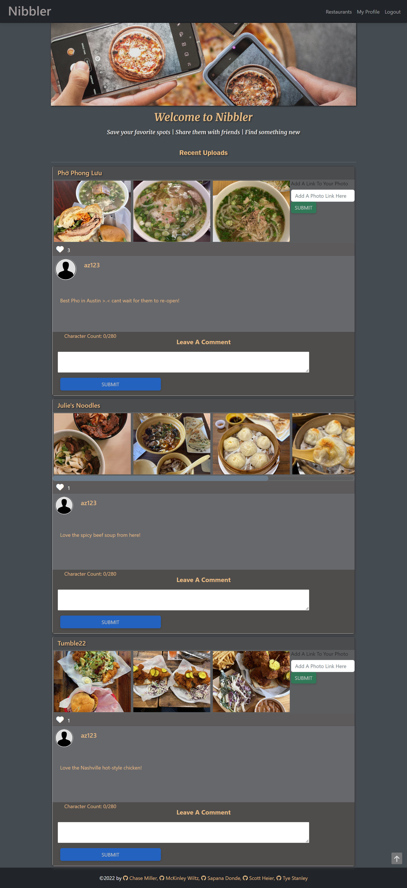
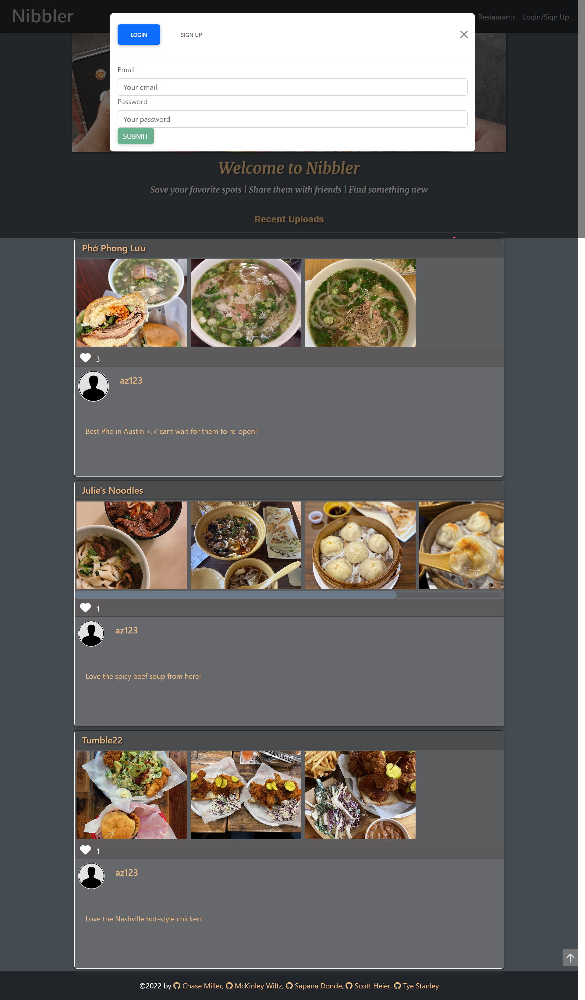
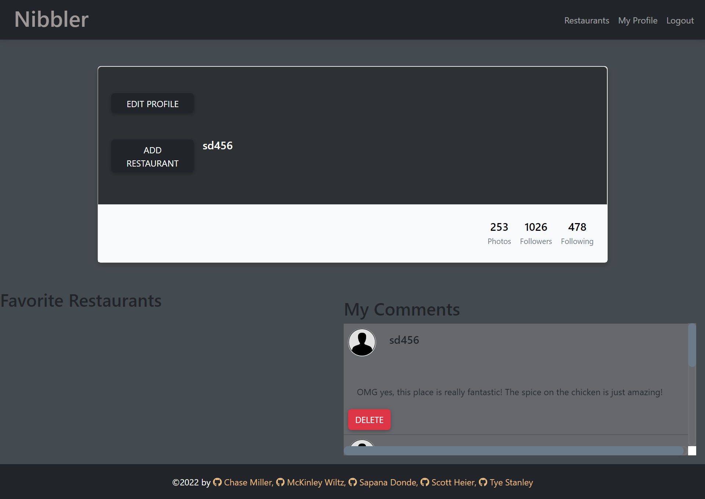
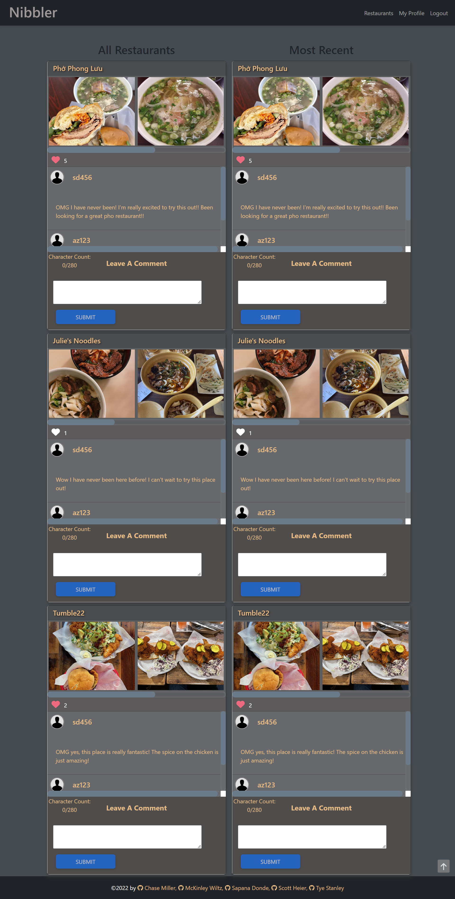

# **Nibbler**

## **Description**
The purpose of this project was to build a full-stack MERN application that would create an online social network to directly connect foodies. Users are able to compare restaurants and their dishes as well as reviews and prices in order to find the right restaurant for them.

## **Table of Contents**
[User Story](#user-story) 
[Acceptance Criteria](#acceptance-criteria) 
[Contributing](#contributing) 
[Built With](#built-with) 
[Sample Screen Shots](#sample-screen-shots) 
[Deliverables](#deliverables) 
 

## **User Story**
AS A USER that loves food and loves going out to eat 
I WANT to share information and learn about different restaurants 
SO THAT I can explore and try out new restaurants 

## **Acceptance Criteria**
- Use React for the front end

- Use GraphQL with a Node.js and Express.js server

- Use MongoDB and the Mongoose ODM for the database

- Use queries and mutations for retrieving, adding, updating, and deleting data

- Be deployed using Heroku (with data)

- Have a polished UI

- Be responsive

- Be interactive (i.e., accept and respond to user input)

- Include authentication (JWT)

- Protect sensitive API key information on the server

- Have a clean repository that meets quality coding standards 

- Have a high-quality README 

- Add PWA functionality:

    - Uses a web manifest

    - Uses a service worker for offline functionality

    - Is installable

## **Contributing**
The following individuals contributed to this project (listed in alphabetical order by last name): 
 
Sapana Donde - Front End and Back End 
Scott Heier - Front End and Back End 
Chase Miller - Back End 
Tye Stanley - Front End 
McKinley Wiltz - Front End 

## **Built With**
* Bcrypt
* Bootstrap
* Dotenv
* Express.js
* GraphQL
* Heroku
* JWT 
* Multer
* MongoDB
* Mongoose ODM
* Node.js
* React
* SASS

## **Sample Screen Shots**
(1) The following screen shot depicts the "Home" page, with recent uploads of restaurants, photos, and comments:

 

(2) The following screen shot depicts the "Sign up / Login" modal:

 

(3) The following screen shot depicts the "Profile" page, which contains functionality to edit the user's profile, add a restaurant, and view and delete comments written by the user:

 

(4) The following screen shot depicts the "Restaurants" page, which contains functionality to view all restaurants as well as the most recently uploaded ones:

 

## **Deliverables**

### **Nibbler Webpage:** 
https://fathomless-peak-48299.herokuapp.com/

### **Nibbler GitHub Repository:** 
https://github.com/TyeStanley/nibbler